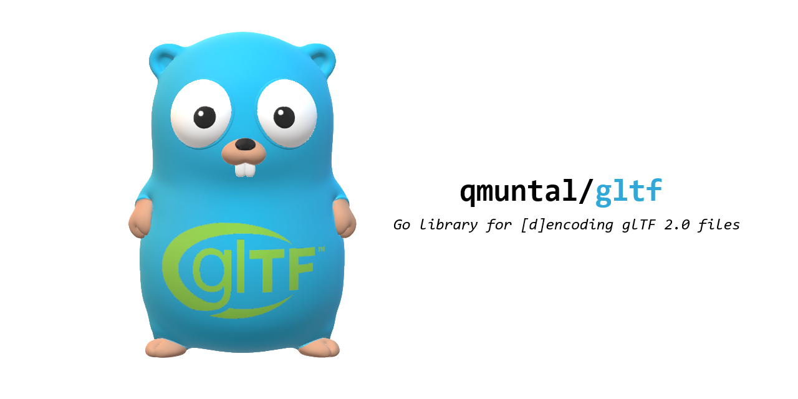
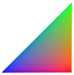

# gltf [](https://pkg.go.dev/github.com/qmuntal/gltf) [](https://travis-ci.com/qmuntal/gltf) [](https://coveralls.io/github/qmuntal/gltf?branch=master) [](https://opensource.org/licenses/BSD-2-Clause) [](https://github.com/avelino/awesome-go)

<div align="center">
    <p>A Go module for efficient and robust serialization/deserialization of glTF 2.0, a royalty-free specification for the efficient transmission and loading of 3D scenes and models by applications, also known as "the JPEG of 3D".</p>
    <p align="center">
        <a href="#star-main-features">Main Features</a> ❘
        <a href="#scroll-getting-started">Getting Started</a> ❘
        <a href="#raising_hand-contributing">Contributing</a> ❘
        <a href="#about-the-project">About The Project</a>
    </p>
</div>

<p align="center"></p>

## :star: Main Features

- [gltf.Document](https://pkg.go.dev/github.com/qmuntal/gltf#Document): Idiomatic glTF data model
- [gltf.Open](https://pkg.go.dev/github.com/qmuntal/gltf#Open) / [gltf.Save](https://pkg.go.dev/github.com/qmuntal/gltf#Save): `.glTF` and `.glb` [d]encoding support
- [qmuntal/gltf/ext](https://pkg.go.dev/github.com/qmuntal/gltf/ext): Built-in extensability mechanism with principal extensions provided out of the box
- [qmuntal/gltf/modeler](https://pkg.go.dev/github.com/qmuntal/gltf/modeler): Friendly package to read and write accessors and buffer views
- [qmuntal/gltf/binary](https://pkg.go.dev/github.com/qmuntal/gltf/binary): Friendly and efficient package to read and write bytes from buffers

## :scroll: Getting started

### Data Model

`qmuntal/gltf` implements the whole glTF 2.0 specification. The top level element is the [gltf.Document](https://pkg.go.dev/github.com/qmuntal/gltf#Document) and it contains all the information to hold a gltf document in memory:

```go
// This document does not produce any valid glTF, it is just an example.
gltf.Document{
  Accessors: []*gltf.Accessor{
      {BufferView: gltf.Index(0), ComponentType: gltf.ComponentUshort, Type: gltf.AccessorScalar},
  },
  Asset: gltf.Asset{Version: "2.0", Generator: "qmuntal/gltf"},
  BufferViews: []*gltf.BufferView{
      {ByteLength: 72, ByteOffset: 0, Target: gltf.TargetElementArrayBuffer},
  },
  Buffers: []*gltf.Buffer{{ByteLength: 1033, URI: bufferData}},
  Meshes: []*gltf.Mesh{{
    Name: "Cube",
  }},
  Nodes: []*gltf.Node{{Name: "Cube", Mesh: gltf.Index(0)}},
  Scene:    gltf.Index(0),
  Scenes:   []*gltf.Scene{{Name: "Root Scene", Nodes: []uint32{0}}},
}
```

### Optional parameters

All optional properties whose default value does not match with the golang type zero value are defines as pointers. Take the following guidelines into account when working with optional values:

- It is safe to not define them when writing the glTF if the desired value is the default one.
- It is safe to expect that the optional values are not nil when reading a glTF.
- When assigning values to optional properties it may be helpful to use these utility functions:
  - `gltf.Index(1)`
  - `gltf.Float(0.5)`

### Reading a document

A [gltf.Document](https://pkg.go.dev/github.com/qmuntal/gltf#Document) can be decoded from any `io.Reader` by using [gltf.Decoder](https://pkg.go.dev/github.com/qmuntal/gltf#Decoder):

```go
resp, _ := http.Get("https://example.com/static/foo.gltf")
var doc gltf.Document
gltf.NewDecoder(resp.Body).Decode(&doc)
fmt.Print(doc.Asset)
```

When working with the file system it is more convenient to use [gltf.Open](https://pkg.go.dev/github.com/qmuntal/gltf#Open) as it automatically manages relative external buffers:

```go
doc, _ := gltf.Open("./foo.gltf")
fmt.Print(doc.Asset)
```

In both cases the decoder will automatically detect if the file is JSON/ASCII (gltf) or Binary (glb) based on its content.

### Writing a document

A [gltf.Document](https://pkg.go.dev/github.com/qmuntal/gltf#Document) can be encoded to any `io.Writer` by using [gltf.Encoder](https://pkg.go.dev/github.com/qmuntal/gltf#Encoder):

```go
var buf bytes.Buffer
gltf.NewEncoder(&buf).Encode(&doc)
http.Post("http://example.com/upload", "model/gltf+binary", &buf)
```

By default `gltf.NewEncoder` outputs a binary file, to generate a JSON/ASCII file set `AsBinary` to false:

```go
var buf bytes.Buffer
enc := gltf.NewEncoder(&buf)
enc.AsBinary = false
enc.Encode(&doc)
http.Post("http://example.com/upload", "model/gltf+json", &buf)
```

When working with the file system it is more convenient to use [gltf.Save](https://pkg.go.dev/github.com/qmuntal/gltf#Save) and [gltf.SaveBinary](https://pkg.go.dev/github.com/qmuntal/gltf#SaveBinary) as it automatically manages relative external buffers:

```go
gltf.Save(&doc, "./foo.gltf")
gltf.SaveBinary(&doc, "./foo.glb")
```

### Manipulating buffer views and accessors

The package [gltf/modeler](https://pkg.go.dev/github.com/qmuntal/gltf/modeler) defines a friendly API to read and write accessors and buffer views, abstracting away all the byte manipulation work and the idiosyncrasy of the glTF spec.

The following example creates a single colored triangle:



```go
doc := gltf.NewDocument()
doc.Meshes = []*gltf.Mesh{{
    Name: "Pyramid",
    Primitives: []*gltf.Primitive{{
        Indices: gltf.Index(modeler.WriteIndices(doc, []uint16{0, 1, 2})),
        Attributes: map[string]uint32{
          gltf.POSITION: modeler.WritePosition(doc, [][3]float32{{0, 0, 0}, {0, 10, 0}, {0, 0, 10}}),
          gltf.COLOR_0:  modeler.WriteColor(doc, [][3]uint8{{255, 0, 0}, {0, 255, 0}, {0, 0, 255}}),
        },
    }},
}}
doc.Nodes = []*gltf.Node{{Name: "Pyramid", Mesh: gltf.Index(0)}}
doc.Scenes[0].Nodes = append(doc.Scenes[0].Nodes, 0)
gltf.Save(doc, "./test.gltf")
```

### Data interleaving

The data of the attributes that are stored in a single bufferView may be stored as an Array-Of-Structures, which may produce a rendering perfomance boost in static attributes. `qmuntal/gltf/modeler` facilitates the creation of interleaved accessors and buffer views with the methods [WriteAttributesInterleaved](https://pkg.go.dev/github.com/qmuntal/gltf/modeler#WriteAttributesInterleaved), [WriteAccessorsInterleaved](https://pkg.go.dev/github.com/qmuntal/gltf/modeler#WriteAccessorsInterleaved), and [WriteBufferViewInterleaved](https://pkg.go.dev/github.com/qmuntal/gltf/modeler#WriteBufferViewInterleaved) being the first one the most recommended for creating mesh primitives:

```go
doc := gltf.NewDocument()
attrs, _ := modeler.WriteAttributesInterleaved(doc, modeler.Attributes{
  Position:       [][3]float32{{0, 0, 0}, {0, 10, 0}, {0, 0, 10}},
  Color:          [][3]uint8{{255, 0, 0}, {0, 255, 0}, {0, 0, 255}},
})
doc.Meshes = []*gltf.Mesh{{
    Name: "Pyramid",
    Primitives: []*gltf.Primitive{{
        Indices: gltf.Index(modeler.WriteIndices(doc, []uint16{0, 1, 2})),
        Attributes: attrs,
    }},
}}
doc.Nodes = []*gltf.Node{{Name: "Pyramid", Mesh: gltf.Index(0)}}
doc.Scenes[0].Nodes = append(doc.Scenes[0].Nodes, 0)
gltf.Save(doc, "./test.gltf")
```

### Manipulating bytes

The package [gltf/binary](https://pkg.go.dev/github.com/qmuntal/gltf/binary) defines a friendly and efficient API to read and write bytes from buffers, abstracting away all the byte manipulation work. This package is very low level and normal users should use `gltf/modeler` instead as it provides another level of abstraction that understands how bytes are associated to other entities.

This package is very similary to the Go `binary` package, the main differences are that it is highly specialized in glTF data types and that it only have to deal with little endian encoding.

### Dealing with extensions

`qmuntal/gltf` is designed to support dynamic extensions. By default only the core specification is decoded and the data inside the extensions objects are stored as `json.RawMessage` so they can be decoded by the caller or automatically encoded when saving the document.

Some of the official extensions are implemented under [ext](ext/).

To decode one of the supported extensions the only required action is to import the associated package, this way the extension will not be stored as `json.RawMessage` but as the type defined in the extension package:

```go
import (
  "github.com/qmuntal/gltf"
  "github.com/qmuntal/gltf/ext/lightspuntual"
)

func main() {
  doc, _ := gltf.Open("./foo.gltf")
    if v, ok := doc.Extensions[lightspuntual.ExtensionName]; ok {
        for _, l := range v.(lightspuntual.Lights) {
            fmt.Print(l.Type)
        }
    }
}
```

It is not necessary to call `gltf.RegisterExtension` for built-in extensions, as these auto-register themselves when the package is initialized.

#### External extension

This list is the list of known extensions implemented in other modules:

- [draco-go/gltf/draco](https://github.com/qmuntal/draco-go)

#### Custom extensions

To implement a custom extension encoding, provide a `struct` that can be encoded as a JSON object as dictated by the spec.

To implement a custom extension decoding, call [gltf.RegisterExtension](https://pkg.go.dev/github.com/qmuntal/gltf#RegisterExtension) at least once before decoding, providing the identifier of the extension and a function that decodes the JSON bytes to the desired `struct`:

```go
const ExtensionName = "FAKE_Extension"

type Foo struct {
    BufferView uint32          `json:"bufferView"`
    Attributes gltf.Attribute  `json:"attributes"`
}

func init() {
    gltf.RegisterExtension(ExtensionName, Unmarshal)
}

func Unmarshal(data []byte) (interface{}, error) {
    foo := new(Foo)
    err := json.Unmarshal(data, foo)
    return foo, err
}
```

## :raising_hand: Contributing

PRs, issues, and feedback from ninja gophers are very welcomed.

## About The Project

This library is a complete implementation of glTF 2.0, and its explicit aim is to provide a production-ready, idiomatic and curated API to perform any kind of glTF manipulation.

It is out of the scope to implement convertes to/from other file formats and to provide mechanisms to create and manipulate 3D geometry.

The current API is still not frozen and can suffer minor changes until it reached v1.0.

Please use the issue tracker or the if you'd like to report problems or discuss features.
